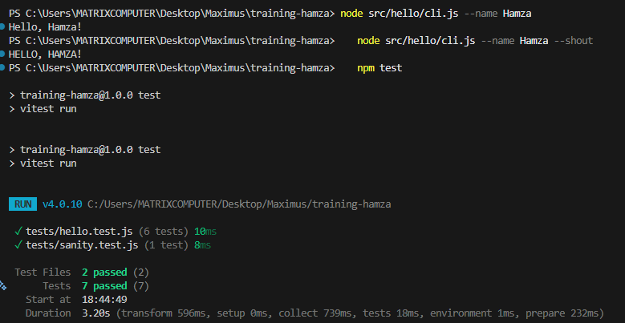

# Review Packet - Chapter 1: Hello CLI

## Overview
Implementation of a simple CLI greeting application with testing and CI/CD.

## PR Information
- **Branch**: `feat/hello-cli`
- **PR Link**: https://github.com/Maximus-Technologies-Uganda/training-hamza/pull/4
- **Status**: Merged

## CI Evidence
- **CI Run Link**: (https://github.com/Maximus-Technologies-Uganda/training-hamza/actions/runs/19504080710/job/55825472124)
- **Status**: ✅ Green

## Journal

### Time Spent
- **Planning & Setup**: 10 - Understanding requirements, setting up structure
- **Implementation**: 10 - Writing formatGreeting, CLI wrapper, and tests
- **Testing & Debugging**: 20 - Running tests, fixing issues
- **Documentation**: 10 - Writing README and review packet
- **Total Time**: 50
### Prompts Used

1. **Initial Setup**
   ```
   "is this a proper test using vitest"
   ```
   - Fixed package.json module type issue

2. **Implementation Request**
   ```
   [List of requirements for formatGreeting, CLI wrapper, tests, etc.]
   ```
   - Implemented all core functionality

3. **Documentation**
   ```
   "i am supposed to update this with all this..."
   ```
   - Creating review packet

### Key Learnings
- ES modules vs CommonJS in Node.js
- Vitest testing framework
- CLI argument parsing with process.argv
- Error handling in Node.js applications

## CLI Command Examples

### Basic Usage

```bash
# Normal greeting
node src/hello/cli.js --name Alice
# Output: Hello, Alice!

# Shouting greeting
node src/hello/cli.js --name Bob --shout
# Output: HELLO, BOB!
```

### Error Cases

```bash
# Missing name argument
node src/hello/cli.js --shout
# Output: Error: --name argument is required
#         Usage: node cli.js --name <name> [--shout]

# Empty name in code
node -e "import('./src/hello/index.js').then(m => m.formatGreeting(''))"
# Output: Error: Name is required
```

### Testing Commands

```bash
# Run all tests once
npm test

# Run tests in watch mode
npm run test:watch
```

## Terminal Screenshot




## Implementation Details

### Files Created

1. **`src/hello/index.js`**
   - Core `formatGreeting(name, shout)` function
   - Handles name validation
   - Returns normal or uppercase greeting

2. **`src/hello/cli.js`**
   - CLI wrapper with argument parsing
   - Error handling and user-friendly messages
   - Process exit codes for errors

3. **`tests/hello.test.js`**
   - 6 test cases covering all scenarios
   - Tests for normal greeting, shout mode, and error cases

4. **`README.md`**
   - Usage examples
   - Error case documentation
   - Project structure

### Test Coverage

All tests passing:
- ✅ Normal greeting (shout=false)
- ✅ Default greeting (shout not provided)
- ✅ Shouting greeting (shout=true)
- ✅ Missing name error
- ✅ Empty string name error
- ✅ Whitespace-only name error

## Next Steps

- [x] Push branch to GitHub
- [x] Open Pull Request
- [x] Add PR link to this document
- [x] Wait for CI checks to complete
- [x] Add CI run link to this document
- [x] Capture and add terminal screenshot
- [x] Request code review
- [x] Address any review feedback
- [x] Merge PR when approved and CI is green


