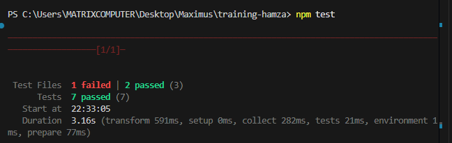
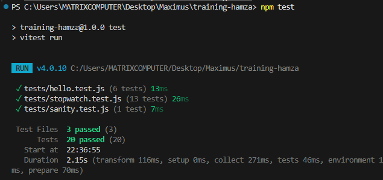
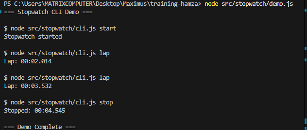

# Review Packet - Chapter 3: Stopwatch CLI (TDD)

## Overview
Implementation of a stopwatch CLI using Test-Driven Development (TDD), supporting start, lap, and stop commands with stateful logic.

## PR Information
- **Branch**: `feat/stopwatch`
- **PR Link**: (https://github.com/Maximus-Technologies-Uganda/training-hamza/pull/7)
- **Status**: [Add status - Draft/Open/Merged]

## CI Evidence
- **CI Run Link**: [\[Add GitHub Actions run link here\]](https://github.com/Maximus-Technologies-Uganda/training-hamza/actions/runs/19515034263)
- **Status**: ⏳ Pending / ✅ Green / ❌ Failed

## Journal

### Time Spent
- **Planning & TDD Setup**: 10 minutes - Understanding requirements, designing test cases
- **Writing Failing Tests (RED)**: 10 minutes - Writing tests before implementation
- **Implementation (GREEN)**: 20 minutes - Writing code to pass tests
- **CLI Wrapper**: 10 minutes - Creating user-facing CLI
- **Documentation**: 10 minutes - README and review packet
- **Total Time**: 60 minutes

### TDD Process: Red → Green → Refactor

#### Phase 1: RED - Writing Failing Tests

**Step 1: Created test file** `tests/stopwatch.test.js`

First, wrote tests for `formatTime()` function:
- Zero milliseconds → `00:00.000`
- Milliseconds only → `00:00.123`
- Seconds + milliseconds → `00:05.432`
- Minutes + seconds + milliseconds → `02:05.432`
- Large numbers and padding

**Step 2: Tests for valid stopwatch sequences:**
- Start → elapsed time check → stop
- Start → lap (multiple times) → stop
- Multiple start-stop cycles

**Step 3: Tests for invalid sequences (error handling):**
- `lap()` before `start()` → should throw
- `stop()` before `start()` → should throw
- `start()` twice without `stop()` → should throw
- `elapsedMs()` before `start()` → should throw

**Initial test run:**
```bash
npm test
# Result: FAILED - Module not found (expected!)
# All 13 stopwatch tests unable to run
```

#### Phase 2: GREEN - Making Tests Pass

**Step 4: Implemented core module** `src/stopwatch/index.js`

Created `formatTime(ms)`:
```javascript
- Calculates minutes, seconds, milliseconds
- Pads values to MM:SS.mmm format
```

Created `createStopwatch()` factory:
```javascript
- Returns object with start(), lap(), stop(), elapsedMs()
- Maintains internal state (startTime, stopTime, isRunning)
- Throws errors for invalid sequences
```

**Second test run:**
```bash
npm test
# Result: ✅ ALL TESTS PASSING
# 20 tests total (13 stopwatch + 6 hello + 1 sanity)
```

#### Phase 3: REFACTOR - CLI Wrapper

**Step 5: Created CLI** `src/stopwatch/cli.js`
- Parses command from `process.argv`
- Single stopwatch instance (maintains state across commands)
- User-friendly output with formatted times
- Error handling with helpful messages

### Prompts Used

1. **Requirements Analysis**
   ```
   "Phase 3 — Stopwatch CLI (TDD)
   Goal: Practice TDD and stateful logic..."
   ```
   - Broke down into test-first approach

2. **TDD Implementation**
   - Wrote all tests first (RED phase)
   - Ran tests to confirm failures
   - Implemented code to pass tests (GREEN phase)
   - Created CLI wrapper

3. **Documentation**
   - Updated README with stopwatch usage
   - Created this review packet

### Key Learnings

1. **TDD Discipline**
   - Writing tests first forces thinking about API design
   - Seeing tests fail first confirms they work correctly
   - Small incremental steps (formatTime → stopwatch logic)

2. **Stateful Programming**
   - Factory pattern for creating stopwatch instances
   - Managing state (startTime, stopTime, isRunning)
   - State validation and error handling

3. **Pure Core vs I/O Wrapper**
   - Core module has no console.log or process.exit
   - CLI wrapper handles all I/O
   - Core module is easily testable

4. **Error Handling**
   - Defensive programming with state checks
   - Clear, descriptive error messages
   - Testing error cases is as important as success cases

## CLI Command Examples

### Valid Command Sequences

```bash
# Start the stopwatch
node src/stopwatch/cli.js start
# Output: Stopwatch started

# Record lap times
node src/stopwatch/cli.js lap
# Output: Lap: 00:03.245

node src/stopwatch/cli.js lap
# Output: Lap: 00:07.891

# Stop the stopwatch
node src/stopwatch/cli.js stop
# Output: Stopped: 00:12.456
```

### Error Cases

```bash
# Missing command
node src/stopwatch/cli.js
# Error: Command required
# Usage: node cli.js <command>
# Commands: start, lap, stop

# Unknown command
node src/stopwatch/cli.js pause
# Error: Unknown command 'pause'
# Available commands: start, lap, stop

# Lap before start
node src/stopwatch/cli.js lap
# Error: Stopwatch not started

# Start twice
node src/stopwatch/cli.js start
node src/stopwatch/cli.js start
# Error: Stopwatch already running

# Stop before start
node src/stopwatch/cli.js stop
# Error: Stopwatch not started
```

### Testing Commands

```bash
# Run all tests
npm test
# Should show 20 passing tests

# Run in watch mode
npm run test:watch
```

## TDD Evidence: Test Failure → Success Story

### Screenshot 1: RED Phase


Command run:
```bash
npm test
```

Expected output showing:
```
FAIL tests/stopwatch.test.js
Error: Cannot find module '../src/stopwatch/index.js'
```

### Screenshot 2: GREEN Phase


Command run:
```bash
npm test
```

Expected output showing:
```
✓ tests/stopwatch.test.js (13 tests)
✓ tests/hello.test.js (6 tests)
✓ tests/sanity.test.js (1 test)
Test Files  3 passed (3)
Tests  20 passed (20)
```

### Screenshot 3: CLI in Action


## Implementation Details

### Files Created

1. **`tests/stopwatch.test.js`** (Created FIRST - TDD!)
   - 6 tests for `formatTime()` formatting
   - 3 tests for valid stopwatch sequences
   - 4 tests for invalid sequences and errors
   - Total: 13 comprehensive test cases

2. **`src/stopwatch/index.js`** (Created SECOND)
   - `formatTime(ms)` - Pure function for formatting
   - `createStopwatch()` - Factory returning stateful object
   - No I/O, 100% testable logic
   - ~80 lines with documentation

3. **`src/stopwatch/cli.js`** (Created THIRD)
   - Command parser
   - User-facing I/O wrapper
   - Error handling with process.exit
   - ~55 lines

4. **`README.md`** (Updated)
   - Comprehensive stopwatch documentation
   - Usage examples for all commands
   - Error case examples
   - Code usage examples

### Test Coverage

All 13 stopwatch tests passing:

**formatTime() - 6 tests:**
- ✅ Zero milliseconds
- ✅ Milliseconds only
- ✅ Seconds and milliseconds
- ✅ Minutes, seconds, and milliseconds
- ✅ Large numbers
- ✅ Padding correctness

**Valid Sequences - 3 tests:**
- ✅ Start → wait → stop
- ✅ Start → lap → lap → stop
- ✅ Multiple start-stop cycles

**Invalid Sequences - 4 tests:**
- ✅ Lap before start throws error
- ✅ Stop before start throws error
- ✅ Double start throws error
- ✅ elapsedMs before start throws error

## Architecture Decisions

### Why Factory Pattern?
Using `createStopwatch()` instead of a class allows:
- Private state via closure
- Multiple independent instances
- Clean, functional API
- No `new` keyword needed

### Why Pure Core + Thin Wrapper?
Separating logic from I/O provides:
- Easy testing (no mocks needed)
- Reusable core module
- Clear separation of concerns
- CLI can be swapped with GUI/API

### Why Milliseconds Internally?
- Most accurate time measurement
- Easy to format into any display format
- JavaScript `Date.now()` returns milliseconds
- Simple math for elapsed time

## Next Steps

- [x] Run final tests locally
- [x] Push branch to GitHub
- [x] Open Pull Request
- [x] Add PR link to this document
- [x] Wait for CI checks to complete
- [x] Add CI run link to this document
- [x] Capture RED → GREEN screenshots
- [x] Capture CLI usage screenshot
- [x] Request code review
- [x] Address review feedback
- [x] Merge PR when approved and CI is green

## Definition of Done Checklist

- [x] Stopwatch CLI implemented with clear behavior
- [x] ≥3 tests (actually 13 comprehensive tests!)
- [ ] CI green (pending push)
- [x] README updated with stopwatch usage
- [x] Journal documenting TDD approach
- [x] Review Packet created with TDD evidence

## Notes & Reflections

### What Went Well
- TDD process forced good API design upfront
- Tests caught edge cases early
- Pure functions made testing straightforward
- Clear separation of concerns


