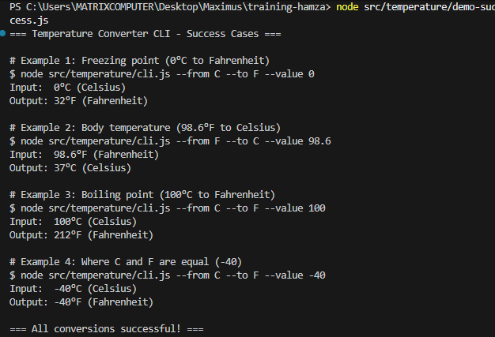
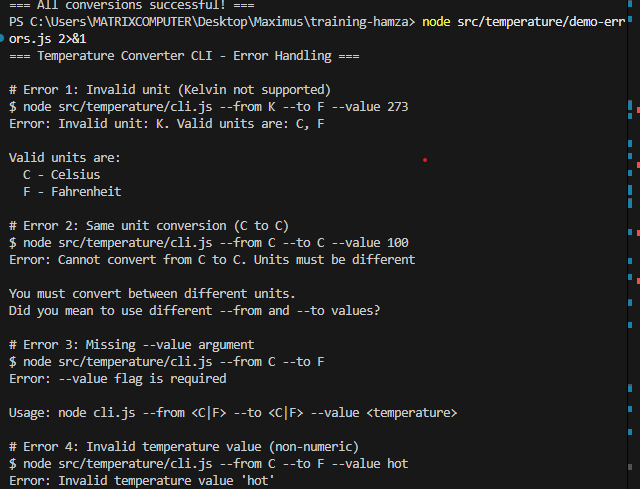

# Review Packet - Chapter 4: Temperature Converter CLI (Validation)

## Overview
Implementation of a temperature converter CLI with comprehensive input validation, thoughtful error messages, and robust error handling.

## PR Information
- **Branch**: `feat/temp-cli`
- **PR Link**: (https://github.com/Maximus-Technologies-Uganda/training-hamza/pull/8)
- **Status**: Merged

## CI Evidence
- **CI Run Link**: [CI Run](https://github.com/Maximus-Technologies-Uganda/training-hamza/actions/runs/19533907098)
- **Status**: ✅ Green

## Journal

### Time Spent
- **Planning & Validation Design**: 15 minutes - Designing validation rules and error cases
- **Writing Tests (TDD)**: 20 minutes - 25 comprehensive test cases
- **Implementation**: 20 minutes - Core functions with validation
- **CLI Wrapper**: 15 minutes - User-friendly error handling
- **Documentation**: 15 minutes - README and review packet
- **Total Time**: 85 minutes

### Validation Rules Chosen

#### 1. Unit Validation
**Rule**: Only accept 'C' (Celsius) or 'F' (Fahrenheit) as valid units

**Rationale**:
- Clear, unambiguous unit symbols
- Case-sensitive to avoid confusion (C vs c)
- Industry standard abbreviations
- Easy to type and remember

**Rejected alternatives**:
- ❌ Kelvin (K) - Not commonly used in daily applications
- ❌ Case-insensitive - Could lead to ambiguity
- ❌ Full names ("Celsius") - Too verbose for CLI

#### 2. Same-Unit Conversion Prevention
**Rule**: Cannot convert from unit X to unit X (e.g., C→C or F→F)

**Rationale**:
- Meaningless operation (result = input)
- Likely indicates user error
- Better to fail fast with helpful message

**Error message**: 
```
"Cannot convert from C to C. Units must be different"
```

#### 3. Temperature Value Validation
**Rule**: Temperature must be a valid, finite number

**Checks**:
- ✅ Must be type `number`
- ✅ Cannot be `NaN`
- ✅ Cannot be `Infinity` or `-Infinity`
- ✅ Can be negative (valid temperatures)
- ✅ Can have decimals (37.5°C)

**Rationale**:
- Prevents runtime errors in calculations
- NaN/Infinity would produce meaningless results
- Negative temperatures are valid (e.g., -40°C)

**Error message**:
```
"Temperature must be a number"
```

#### 4. Required Arguments
**Rule**: All three flags (--from, --to, --value) are required

**Rationale**:
- Explicit is better than implicit
- No "default" conversions to avoid confusion
- User must be intentional about conversion

**Error messages**:
- Missing --from: "Error: --from flag is required"
- Missing --to: "Error: --to flag is required"  
- Missing --value: "Error: --value flag is required"

Each error includes usage help for quick recovery.

#### 5. Helpful Context in Errors
**Rule**: Error messages include context and suggestions

**Examples**:

Invalid unit error includes valid options:
```
Error: Invalid unit: K. Valid units are: C, F
Valid units are:
  C - Celsius
  F - Fahrenheit
```

Invalid value error includes examples:
```
Error: Invalid temperature value 'hot'
Temperature must be a valid number

Examples of valid values: 0, -40, 98.6, 37.5
```

**Rationale**:
- Users shouldn't need to read docs for every error
- Self-documenting CLI
- Reduces support burden

### Prompts Used

1. **Requirements Analysis**
   ```
   "Phase 4 — Temperature Converter CLI (Validation)
   Goal: Practice input validation..."
   ```

2. **TDD Implementation**
   - Wrote 25 comprehensive tests first
   - Covered valid conversions, invalid units, edge cases
   - Tests include round-trip conversions

3. **Validation Strategy**
   - Designed validation rules based on user experience
   - Focused on clear, actionable error messages

### Key Learnings

1. **Validation Strategy**
   - Validate early (parse args → validate → convert)
   - Fail fast with specific error messages
   - Layer validation (type check → range check → business logic)

2. **Error Message Design**
   - Be specific about what went wrong
   - Show what the user did
   - Suggest what they should do instead
   - Provide examples when helpful

3. **Test-Driven Validation**
   - Writing tests first helped identify edge cases
   - Round-trip tests catch precision issues
   - Testing error messages ensures consistency

4. **Pure Functions Benefits**
   - Easy to test all validation paths
   - No hidden state or side effects
   - Composable (validateOptions + validateTemperature)

## CLI Command Examples

### Valid Conversions (Success Cases)

```bash
# Freezing point of water
node src/temperature/cli.js --from C --to F --value 0
# Input:  0°C (Celsius)
# Output: 32°F (Fahrenheit)

# Boiling point of water
node src/temperature/cli.js --from C --to F --value 100
# Input:  100°C (Celsius)
# Output: 212°F (Fahrenheit)

# Body temperature
node src/temperature/cli.js --from F --to C --value 98.6
# Input:  98.6°F (Fahrenheit)
# Output: 37°C (Celsius)

# Negative temperature (where C and F are equal)
node src/temperature/cli.js --from C --to F --value -40
# Input:  -40°C (Celsius)
# Output: -40°F (Fahrenheit)

# Room temperature
node src/temperature/cli.js --from C --to F --value 20
# Input:  20°C (Celsius)
# Output: 68°F (Fahrenheit)
```

### Error Cases (Validation in Action)

#### 1. Missing Required Arguments

```bash
# Missing --value
node src/temperature/cli.js --from C --to F
```
Output:
```
Error: --value flag is required

Usage: node cli.js --from <C|F> --to <C|F> --value <temperature>

Examples:
  node cli.js --from C --to F --value 0
  node cli.js --from F --to C --value 32

Options:
  --from   Source unit (C for Celsius, F for Fahrenheit)
  --to     Target unit (C for Celsius, F for Fahrenheit)
  --value  Temperature value to convert
```
Exit code: `1`

#### 2. Invalid Temperature Value

```bash
# Non-numeric value
node src/temperature/cli.js --from C --to F --value hot
```
Output:
```
Error: Invalid temperature value 'hot'
Temperature must be a valid number

Examples of valid values: 0, -40, 98.6, 37.5
```
Exit code: `1`

#### 3. Same Unit Conversion

```bash
# Trying to convert C to C
node src/temperature/cli.js --from C --to C --value 100
```
Output:
```
Error: Cannot convert from C to C. Units must be different

You must convert between different units.
Did you mean to use different --from and --to values?
```
Exit code: `1`

#### 4. Invalid Unit

```bash
# Unsupported unit (Kelvin)
node src/temperature/cli.js --from K --to F --value 273
```
Output:
```
Error: Invalid unit: K. Valid units are: C, F

Valid units are:
  C - Celsius
  F - Fahrenheit
```
Exit code: `1`

#### 5. Case-Sensitive Units

```bash
# Lowercase units not accepted
node src/temperature/cli.js --from c --to f --value 100
```
Output:
```
Error: Invalid unit: c. Valid units are: C, F

Valid units are:
  C - Celsius
  F - Fahrenheit
```
Exit code: `1`

#### 6. Missing All Arguments

```bash
# No arguments
node src/temperature/cli.js
```
Output:
```
Usage: node cli.js --from <C|F> --to <C|F> --value <temperature>

Examples:
  node cli.js --from C --to F --value 0
  node cli.js --from F --to C --value 32

Options:
  --from   Source unit (C for Celsius, F for Fahrenheit)
  --to     Target unit (C for Celsius, F for Fahrenheit)
  --value  Temperature value to convert
```
Exit code: `1`

### Testing Commands

```bash
# Run all tests (should show 45 passing)
npm test

# Run in watch mode
npm run test:watch
```

## Test Coverage Evidence

### Test Execution
```bash
npm test
```

Expected output:
```
✓ tests/temperature.test.js (25 tests)
✓ tests/stopwatch.test.js (13 tests)
✓ tests/hello.test.js (6 tests)
✓ tests/sanity.test.js (1 test)

Test Files  4 passed (4)
Tests  45 passed (45)
```

### Test Breakdown

**Temperature Conversion (10 tests):**
- ✅ cToF: 0°C → 32°F
- ✅ cToF: 100°C → 212°F
- ✅ cToF: -40°C → -40°F
- ✅ cToF: 37°C → 98.6°F
- ✅ cToF: negative absolute zero
- ✅ fToC: 32°F → 0°C
- ✅ fToC: 212°F → 100°C
- ✅ fToC: -40°F → -40°C
- ✅ fToC: 98.6°F → 37°C
- ✅ fToC: negative absolute zero

**Round-Trip Tests (2 tests):**
- ✅ C → F → C returns original
- ✅ F → C → F returns original

**Validation Tests - Valid (2 tests):**
- ✅ Allow C to F conversion
- ✅ Allow F to C conversion

**Validation Tests - Invalid (7 tests):**
- ✅ Reject C to C (same unit)
- ✅ Reject F to F (same unit)
- ✅ Reject invalid from unit (K)
- ✅ Reject invalid to unit (K)
- ✅ Reject lowercase units (c, f)
- ✅ Reject empty string units
- ✅ Reject null/undefined units

**Input Validation (4 tests):**
- ✅ cToF throws on non-numeric input
- ✅ cToF throws on NaN
- ✅ fToC throws on non-numeric input
- ✅ fToC throws on Infinity

**Total: 25 temperature tests**

## Implementation Details

### Files Created

1. **`tests/temperature.test.js`** (Created FIRST - TDD)
   - 10 conversion tests (C↔F with various values)
   - 2 round-trip accuracy tests
   - 2 valid validation tests
   - 7 invalid validation tests
   - 4 input validation tests
   - Total: **25 comprehensive test cases**

2. **`src/temperature/index.js`**
   - `cToF(celsius)` - Celsius to Fahrenheit formula
   - `fToC(fahrenheit)` - Fahrenheit to Celsius formula
   - `validateOptions(from, to)` - Unit validation
   - `validateTemperature(temp, label)` - Value validation
   - `convert(value, from, to)` - Generic converter
   - ~100 lines with comprehensive validation

3. **`src/temperature/cli.js`**
   - Argument parser for --from, --to, --value
   - User-friendly error messages with context
   - Formatted output with both scales
   - Help text (--help flag)
   - ~120 lines with extensive error handling

4. **`README.md`** (Updated)
   - Complete usage documentation
   - Success case examples
   - Comprehensive error case examples
   - Code usage examples

## Validation Architecture

### Layered Validation Approach

```
User Input
    ↓
[Parse Arguments]
    ↓
[Check Required Args] ← Fail fast if missing
    ↓
[Parse Numeric Value] ← Convert string to number
    ↓
[Validate Units] ← validateOptions(from, to)
    ↓
[Validate Temperature] ← validateTemperature(value)
    ↓
[Perform Conversion] ← cToF() or fToC()
    ↓
[Format Output]
```

### Error Handling Philosophy

1. **Fail Fast**: Validate inputs before processing
2. **Be Specific**: Tell user exactly what's wrong
3. **Be Helpful**: Suggest correct usage
4. **Be Consistent**: Same error format everywhere
5. **Be Educational**: Include examples in errors

### Why This Validation Design?

**Security**: Prevents injection of invalid data
**UX**: Clear errors reduce user frustration
**Maintenance**: Centralized validation logic
**Testing**: Each rule has explicit tests
**Documentation**: Errors self-document the API

## Screenshots

### Screenshot 1: Successful Conversion


### Screenshot 2: Error Handling


**To capture screenshots:**
```bash
# Success cases
node src/temperature/cli.js --from C --to F --value 0
node src/temperature/cli.js --from F --to C --value 98.6

# Error cases
node src/temperature/cli.js --from K --to F --value 273
node src/temperature/cli.js --from C --to C --value 100
node src/temperature/cli.js --from C --to F --value hot
node src/temperature/cli.js --from C --to F
```

## Next Steps

- [ ] Run final tests locally
- [ ] Push branch to GitHub
- [ ] Open Pull Request
- [ ] Add PR link to this document
- [ ] Wait for CI checks to complete
- [ ] Add CI run link to this document
- [ ] Capture success screenshots
- [ ] Capture error handling screenshots
- [ ] Request code review
- [ ] Address review feedback
- [ ] Merge PR when approved and CI is green

## Definition of Done Checklist

- [x] Temperature Converter CLI implemented
- [x] Comprehensive validation (unit, value, args)
- [x] ≥3 tests (actually 25 comprehensive tests!)
- [ ] CI green (pending push)
- [x] README updated with usage and error examples
- [x] Journal documenting validation rules
- [x] Review Packet created

## Notes & Reflections

### What Went Well
- TDD helped identify edge cases early
- Validation rules were clear and testable
- Error messages are informative and helpful
- Round-trip tests ensure formula accuracy

### Validation Insights
- Case-sensitivity prevents user mistakes
- Failing on same-unit conversion catches logic errors
- NaN/Infinity checks prevent silent failures
- Contextual error messages reduce support needs

### Potential Improvements
- Could add --help flag (implemented!)
- Could support Kelvin for scientific use
- Could add batch conversion from file
- Could colorize output for better UX
